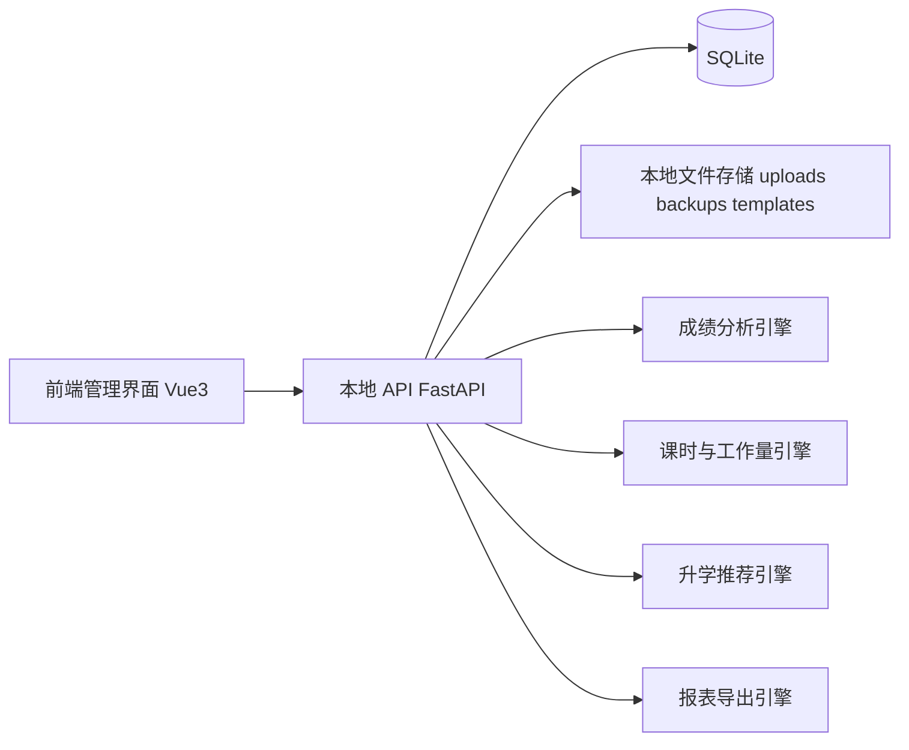

# 本地教务工具开发文档（适配 Codex CLI 执行）

- 文档版本：v1.0
- 文档日期：2026-04-03
- 目标形态：本地优先运行，同时支持学校服务器 HTTPS 受控多人使用
- 推荐交付形式：本地 Web 应用（`localhost`）+ 本地数据库 + 本地文件存储
- 文档用途：作为 Codex CLI 的产品需求文档、技术方案文档、实施路线图与验收标准

---

## 1. 项目背景与目标

### 1.1 项目背景

需要建设一个**本地教务工具**，用于高中学校场景，服务单个使用者的日常数据管理与分析决策，覆盖以下核心场景：

1. 管理学生基础信息与学生成长档案。
2. 记录、导入、清洗并分析学生成绩。
3. 结合成绩、位次、学生类别，为学生推荐高考院校及专业。
4. 对艺体生进行特殊标注，并提供艺体相关专业与院校推荐逻辑。
5. 收录历年院校录取信息，形成院校信息库与专业信息库。
6. 管理教师基础信息、职称、任教关系、课表、课时、工作量。
7. 统计教师任教班级成绩、教学分析、评教结果与班主任量化数据。

### 1.2 项目定位

本项目不是开放注册的公众教务平台，而是一个**本地优先、学校受控、数据驱动的教务决策台**。单机本地形态仍保留；当部署到学校服务器时，按管理员与教师两类账号使用。

### 1.3 核心建设目标

1. 建立统一的数据底座，避免学生、教师、考试、院校数据散落在多个 Excel 文件中。
2. 以“导入方便、分析可靠、结果可追溯、导出可汇报”为产品原则。
3. 先实现高频刚需功能，再逐步扩展到成长档案、院校推荐、评教等模块。
4. 所有关键计算规则必须可配置，避免硬编码。
5. 所有敏感数据默认保存在学校本机或学校自有服务器，不依赖云数据库；公网部署必须走 HTTPS 与受控账号。

### 1.4 成功标准

1. 能在本地导入学生、教师、成绩、课表、录取数据。
2. 能完成学生成绩分析、班级分析、教师任教分析、课时与工作量统计。
3. 能基于历年录取数据给出“冲 / 稳 / 保”推荐结果。
4. 能为艺体生单独标识并执行艺体推荐规则。
5. 能导出 Excel 报表，并提供本地备份与恢复。
6. 能作为后续迭代的基础工程继续扩展，不因规则变化而推倒重来。

---

## 2. 建设边界与原则

### 2.1 当前建设边界（明确纳入）

- 本地单机运行
- 学校服务器 HTTPS 部署
- 管理员与普通教师两类账号
- 教师账号由管理员创建，不开放教师自助注册
- 浏览器访问本机 `localhost`
- 浏览器访问学校域名 `https://你的域名/`
- 本地 SQLite 数据库存储
- 本地目录存放附件、模板、备份文件
- Excel 批量导入/导出
- 成绩分析、工作量统计、院校推荐、成长档案、评教汇总

### 2.2 当前明确不做（至少在 v1 不做）

- 开放式公网注册
- 学生 / 家长账号
- 短信、邮件找回或 SSO
- 多学校 / 多租户 SaaS
- 手机 App
- 微信端/小程序
- 实时消息通知
- 第三方在线支付、短信、邮件服务
- 复杂审批流
- 基于外部 AI 服务的在线问答依赖

### 2.3 建设原则

1. **Local First**：运行、存储、备份都以本地为主。
2. **单一事实来源**：数据库是唯一真实来源，Excel 仅负责导入导出。
3. **规则配置化**：工作量规则、成绩阈值、推荐策略均由配置决定。
4. **历史可追溯**：保留任教历史、班级历史、考试快照、录取年度数据。
5. **先可用再完善**：先完成高频刚需流程，再扩展高级功能。
6. **中文优先**：界面、提示、报表均以中文为默认语言。
7. **Windows 优先兼容**：目标使用环境优先考虑 Windows 10/11。

---

## 3. 建议技术路线

## 3.1 总体推荐

采用“**前后端分离但本地运行**”架构：

- 前端：Vue 3 + TypeScript + Vite + Element Plus + Pinia + Vue Router + ECharts
- 后端：Python 3.11 + FastAPI + SQLAlchemy 2.x / SQLModel + Pydantic 2 + Alembic
- 数据分析：pandas + openpyxl + numpy
- 数据库：SQLite（启用 WAL 模式）
- 测试：Pytest + httpx + Vitest + Playwright
- 打包方式：第一阶段本地启动脚本；第二阶段可选 PyInstaller 或桌面包装

## 3.2 选型理由

1. **Python 后端更适合成绩分析、Excel 导入导出、规则计算、报表处理。**
2. **Vue + Element Plus 更适合表单、表格、管理后台、中文管理界面。**
3. **SQLite 足够支撑单机或单学校受控使用场景，部署和备份成本低。**
4. **FastAPI 适合快速构建本地 API，文档化和测试友好。**
5. **后续如需升级为局域网版本，也可在现有架构上扩展。**

## 3.3 不建议的路线

- 纯 Excel 拼凑方案：后期难维护、难追溯、分析逻辑混乱。
- 一开始就做复杂桌面原生客户端：迭代慢、实现成本高。
- 一开始引入多用户权限系统：超出当前真实需求。

---

## 4. 总体架构设计



### 4.1 系统分层

1. **展示层**：前端页面、表格、图表、导入向导、报表预览。
2. **接口层**：REST API、文件上传、导入导出接口。
3. **业务层**：成绩分析、推荐规则、工作量计算、评教统计、档案管理。
4. **数据层**：SQLite 表结构、索引、快照表、配置表。
5. **文件层**：附件、模板、备份包、导入日志文件。

### 4.2 本地存储目录约定

```text
project-root/
  apps/
    backend/
    frontend/
  data/
    app.db
    uploads/
    backups/
    templates/
    exports/
    logs/
  docs/
    local_edu_tool_dev_spec.md
  scripts/
  tests/
  AGENTS.md
  README.md
```

### 4.3 运行方式

- 开发环境：分别启动前端和后端。
- 生产本地环境：后端提供 API 与静态文件，启动后自动打开浏览器访问 `http://127.0.0.1:<port>`。
- 学校服务器环境：Nginx 提供 `https://你的域名/`，前端走 `/`，后端 `/api` 反向代理到 `127.0.0.1:8000`。
- 数据保存到本机或服务器指定的 `data/` 目录。

---

## 4.4 账号与权限边界

### 账号类型

1. `admin` 管理员：拥有全部功能权限。
2. `teacher` 普通教师：只能处理本人任教或班主任关联班级的学生、成绩、分析和报表。

教师账号不开放注册。管理员通过“账号管理”创建教师账号，并关联教师档案；教师首次登录必须修改初始密码。

### 会话与安全

1. 浏览器只保存 `HttpOnly + Secure + SameSite=Strict` Cookie。
2. 会话 token 只以哈希形式保存到数据库。
3. 写操作带 CSRF 请求头，后端统一校验。
4. 密码使用 Argon2 哈希。
5. 禁用账号、重置密码、退出登录会吊销相关会话。

### 教师范围

教师可访问班级范围由三部分合并：

1. 作为班主任的班级。
2. 任教关系中的班级。
3. 管理员手动补充授权的班级。

教师访问范围外学生或成绩时，后端返回 `403`；前端隐藏无权限菜单和按钮。

### 管理员专属能力

账号管理、系统设置、备份恢复、基础字典写入、教师主档维护、高考数据维护、推荐规则维护、学生批量删除、批量调班等能力仅管理员可用。

---

## 5. 功能范围总览

### 5.1 P0（必须优先实现）

1. 基础数据中心
2. 学生管理
3. 教师管理
4. 考试与成绩导入
5. 学生成绩分析
6. 班级成绩分析
7. 任教关系管理
8. 课表导入与课时统计
9. 教师工作量计算
10. 报表导入导出
11. 本地备份恢复

### 5.2 P1（完成 P0 后继续实现）

1. 学生成长档案
2. 学生教师评语
3. 院校信息库 / 专业库 / 录取库
4. 推荐中心（普通生）
5. 推荐中心（艺体生）
6. 班主任量化管理
7. 评教管理（以模板配置 + 数据导入 + 汇总分析为主）

### 5.3 P2（后续增强）

1. PDF/打印排版优化
2. 桌面打包
3. 更精细的推荐策略与策略解释
4. 更复杂的分析看板
5. 多学年全景对比
6. 局域网多人版预留

---

## 6. 信息架构与菜单设计

```text
工作台
基础数据
  - 学年学期
  - 年级班级
  - 学科与课程类型
  - 学生类别与艺体方向
  - 教师职称与岗位字典
学生中心
  - 学生列表
  - 学生详情
  - 批量导入
  - 成长档案
  - 教师评语
  - 推荐记录
考试成绩中心
  - 考试管理
  - 科目配置
  - 成绩导入
  - 成绩查询
  - 学生分析
  - 班级分析
  - 年级分析
  - 任课教师分析
教师中心
  - 教师列表
  - 职称管理
  - 任教安排
  - 课表管理
  - 课时统计
  - 工作量统计
  - 教学分析
升学中心
  - 院校库
  - 专业库
  - 历年录取数据
  - 推荐配置
  - 学生推荐
  - 批量推荐
评教与量化
  - 评教模板
  - 评教数据导入
  - 评教结果统计
  - 班主任量化规则
  - 班主任量化记录
报表中心
  - 学生报表
  - 班级报表
  - 教师报表
  - 推荐报表
系统设置
  - 账号管理
  - 参数配置
  - 导入模板
  - 备份恢复
  - 操作日志
```

---

## 7. 详细功能需求

## 7.1 工作台

### 页面目标
在进入系统后快速看到关键概况和常用入口。

### 功能点
1. 学生总数、教师总数、当前年级/班级数。
2. 最近一次考试摘要：考试名称、时间、参与人数、平均分、优秀率。
3. 最近导入记录：学生导入、成绩导入、课表导入、录取数据导入。
4. 快捷入口：新增考试、导入成绩、计算工作量、生成推荐、创建备份。
5. 数据质量提醒：缺失学生学号、教师工号重复、课表未映射科目、成绩异常值。
6. 最近备份时间提示。

---

## 7.2 基础数据中心

### 功能目标
统一维护系统运行所依赖的主数据与字典配置。

### 模块内容
1. 学年管理
2. 学期管理
3. 年级管理
4. 班级管理
5. 班型管理（普通班、重点班、实验班、艺体班等）
6. 学科管理
7. 课程类型管理（正课、自习、早读、晚修、实验、辅导、社团等）
8. 学生类别管理（普通生、艺体生、复读生等）
9. 艺体方向管理（美术、体育、音乐、舞蹈、传媒等）
10. 教师职称与岗位字典
11. 批次、选科要求、院校层级等字典

### 关键要求
- 所有枚举值尽量从字典表读取，不写死在代码里。
- 支持启用/禁用，不建议直接物理删除。
- 支持批量导入和导出。

---

## 7.3 学生中心

### 7.3.1 学生列表

#### 功能点
1. 按学号、姓名、年级、班级、状态、学生类别、艺体方向筛选。
2. 支持排序、分页、导出、批量修改标签。
3. 显示学生基础摘要：学号、姓名、当前班级、类别、艺体方向、联系方式、状态。
4. 支持批量导入与模板下载。

#### 关键字段
- 学号
- 姓名
- 性别
- 出生日期
- 身份证号（可选）
- 入学年份
- 当前年级
- 当前班级
- 学生状态（在读、休学、毕业、转出等）
- 学生类别
- 艺体方向
- 联系电话
- 家庭住址
- 备注

### 7.3.2 学生详情页

#### 页面结构
- 基础信息
- 家庭联系人
- 学籍/班级变动历史
- 成绩摘要
- 成长档案
- 教师评语
- 推荐记录
- 附件

#### 功能点
1. 查看学生历次考试趋势。
2. 查看当前薄弱学科与优势学科。
3. 查看成长记录时间线。
4. 查看任课教师对该生留下的评语，用于调班、换教师后的快速交接。
5. 查看该生院校推荐历史与导出报告。
6. 上传附件：照片、PDF、扫描件、获奖证明等。

#### 教师评语规则
- 评语作为轻量留言独立存储，不写入学生成长档案，也不直接替代奖惩、谈话、家校沟通等正式成长记录。
- 管理员可查看学生评语；普通教师只能查看本人班级范围内学生的评语。
- 普通教师发布评语时，账号必须关联教师档案，并且该教师在当前任教学期内任教该学生当前或历史所在班级的对应科目。
- 评语记录保留发布教师、科目、班级、学期、时间和正文；账号停用、学生调班后历史评语仍保留，方便新教师接手。

### 7.3.3 学生批量导入

#### 要求
1. 提供 Excel 模板下载。
2. 导入前先做字段校验、重复校验、必填校验。
3. 允许“新增”“更新”“跳过已存在”三种策略。
4. 导入后输出结果日志：成功数、失败数、失败原因。

---

## 7.4 学生成长档案

### 功能目标
以时间线方式记录学生在校成长过程。

### 记录类型
1. 奖励记录
2. 处分记录
3. 活动记录
4. 干部任职记录
5. 谈话记录
6. 家校沟通记录
7. 心理关注记录
8. 综合素质评价记录
9. 其他自定义类型

### 功能点
1. 新增/编辑/删除成长记录。
2. 记录发生日期、标题、分类、内容、责任人、备注。
3. 绑定多个附件。
4. 支持按日期范围和分类筛选。
5. 支持导出单个学生成长档案摘要。

### 设计要求
- 文本信息与附件分开存储。
- 附件只保存本地相对路径与元信息，不将大文件写进数据库。

---

## 7.5 教师中心

## 7.5.1 教师列表

### 功能点
1. 按工号、姓名、学科、职称、年级组、班主任状态筛选。
2. 支持导入导出。
3. 支持维护教师基础信息、联系方式、备注。

### 关键字段
- 工号
- 姓名
- 性别
- 学科
- 联系方式
- 当前职称
- 岗位
- 是否班主任
- 任教状态
- 入职日期
- 备注

## 7.5.2 职称与任教历史

### 功能点
1. 维护教师职称历史（开始日期、结束日期、职称类型）。
2. 维护任教安排：教师、学期、年级、班级、学科、课程类型。
3. 允许一名教师对应多个班级和多门课程。
4. 保留历史记录，不覆盖历史。

## 7.5.3 任教分析

### 功能点
1. 查看教师所任教班级在某次考试中的平均分、优秀率、及格率、名次分布。
2. 比较同学科不同教师、同层次班级之间的差异。
3. 展示历次考试趋势。
4. 支持按教师导出教学分析表。

### 设计约束
- 系统给出“教学数据参考”，不要默认输出带有价值判断的结论。
- 不做“自动绩效裁定”，仅提供统计支持。

---

## 7.6 课表管理、课时统计、工作量统计

## 7.6.1 课表导入

### 输入来源
- Excel 课程表
- 手工录入

### 导入字段建议
- 学期
- 星期
- 节次
- 教师
- 班级
- 学科
- 课程类型
- 周次规则（全周 / 单周 / 双周 / 指定周）
- 备注

### 功能点
1. 解析 Excel 课表。
2. 自动映射教师、班级、学科，无法匹配的项目进入“待修正列表”。
3. 支持手工修正、重新计算。
4. 支持多份课表批次管理。

## 7.6.2 课时统计

### 统计方式
1. 按周统计。
2. 按月统计。
3. 按学期统计。

### 统计维度
- 教师
- 学科
- 班级
- 课程类型
- 年级

### 输出指标
- 周课时数
- 月度累计课时
- 学期累计课时
- 各课程类型占比

## 7.6.3 工作量计算

### 核心要求
工作量计算必须**配置化**，不能写死。

### 配置维度
1. 学科系数
2. 年级系数
3. 班型系数
4. 课程类型系数
5. 班额区间系数
6. 班主任附加分/附加量
7. 早读、晚修、自习、辅导、社团等额外项目系数
8. 手工补录项

### 默认计算公式建议

```text
工作量 = Σ(课时数 × 学科系数 × 年级系数 × 班型系数 × 课程类型系数 × 班额系数) + 班主任附加量 + 额外事项量化
```

### 功能点
1. 配置工作量规则版本。
2. 根据某学期课表自动计算教师工作量。
3. 支持手工调整与说明记录。
4. 输出教师月度/学期工作量明细与汇总。
5. 保留计算快照，避免规则变更后影响历史结果。

---

## 7.7 考试与成绩中心

## 7.7.1 考试管理

### 功能点
1. 创建考试：名称、考试时间、考试类型、适用年级、学期、是否计入趋势分析。
2. 维护考试科目：科目、满分、是否计入总分、科目顺序。
3. 为不同考试设置优秀线、及格线、分段区间。
4. 支持复制历史考试配置创建新考试。

### 考试类型示例
- 月考
- 期中
- 期末
- 联考
- 模考
- 艺体专业测试
- 其他自定义类型

## 7.7.2 成绩导入

### 输入模板建议列
- 考试名称/考试 ID
- 学号
- 姓名
- 班级
- 科目
- 分数
- 缺考标记
- 备注

### 导入规则
1. 优先按学号匹配学生，姓名仅作辅助校验。
2. 同一考试 + 同一学生 + 同一科目必须唯一。
3. 允许覆盖导入，但必须记录导入批次和操作者说明。
4. 对异常分数（负数、超满分、空值）进行拦截或警告。
5. 导入后可触发统计重建。

## 7.7.3 成绩查询

### 查询维度
- 按学生
- 按考试
- 按班级
- 按年级
- 按科目
- 按教师任教关系

### 展示内容
- 原始分
- 总分
- 班级名次
- 年级名次
- 百分位
- 优势/薄弱科目
- 历次趋势

## 7.7.4 学生成绩分析

### 指标
1. 单科成绩
2. 总分
3. 班级名次
4. 年级名次
5. 百分位
6. 与上次考试比较：分数变化、名次变化、百分位变化
7. 优势/薄弱学科识别
8. 学科均衡性分析

### 规则建议
- 横向比较使用原始分 + 名次。
- 纵向趋势优先使用百分位或位次变化，而不是单纯原始分。
- 缺考与免考应单独标记，不直接混为 0 分。

## 7.7.5 班级成绩分析

### 指标
1. 平均分
2. 中位数
3. 最高分
4. 最低分
5. 标准差
6. 优秀率
7. 及格率
8. 各分段人数分布
9. 班级整体趋势
10. 班级与年级均值对比

## 7.7.6 年级成绩分析

### 功能点
1. 年级总览看板。
2. 各班横向对比。
3. 各学科横向对比。
4. 分数段与名次段统计。
5. 学科贡献度对比。

## 7.7.7 任课教师成绩分析

### 功能点
1. 基于“教师-班级-学科-学期”任教关系聚合成绩。
2. 查看任教班级的平均分、优秀率、及格率、提升情况。
3. 支持同学科横向对比与历次考试趋势。
4. 支持导出教师维度分析报表。

---

## 7.8 升学中心

## 7.8.1 院校信息库

### 功能点
1. 维护院校基础信息。
2. 维护院校别名与历史名称。
3. 支持按地区、院校层级、办学性质、是否艺体相关等筛选。

### 建议字段
- 院校名称
- 院校代码（可选）
- 所在省份/城市
- 办学性质
- 院校层级标签
- 院校简介
- 官方网址（可选）
- 是否支持艺体招生
- 备注

## 7.8.2 专业信息库

### 功能点
1. 维护专业基础信息。
2. 维护专业门类、学科方向、就业方向。
3. 标记是否适用于艺体生。
4. 支持与院校建立多对多关系。

### 建议字段
- 专业名称
- 专业代码（可选）
- 专业门类
- 是否艺体相关
- 专业说明
- 备注

## 7.8.3 历年录取数据

### 录取数据粒度建议
按“年份 + 省份 + 批次 + 院校 + 专业（可选） + 学生类别 / 选科要求”维护。

### 核心字段
- 年份
- 省份
- 批次
- 院校
- 专业（可为空，表示院校级别）
- 最低分
- 最低位次
- 平均分（可选）
- 最高分（可选）
- 计划人数（可选）
- 选科要求
- 学生类别（普通 / 艺体 / 体育 / 美术等）
- 数据来源说明

### 功能点
1. Excel 批量导入历年数据。
2. 支持多年度数据并存。
3. 支持按年份筛选查询。
4. 支持查看院校录取趋势。

---

## 7.9 推荐中心

## 7.9.1 普通生推荐

### 输入条件
1. 学生或批量学生
2. 参考考试
3. 学生总分与位次
4. 省份
5. 选科组合
6. 目标地区偏好
7. 院校层级偏好
8. 专业方向偏好
9. 是否服从调剂（可选）

### 输出内容
1. 冲刺院校/专业
2. 稳妥院校/专业
3. 保底院校/专业
4. 推荐理由说明
5. 风险提示
6. 可导出的推荐单

### 推荐核心逻辑
推荐以**位次为主、分数为辅**。

#### 推荐策略建议
- 若学生位次优于目标院校近三年最低位次较多，则进入“保”。
- 若学生位次与目标院校历史最低位次接近，则进入“稳”。
- 若学生位次略弱于目标院校历史最低位次，则进入“冲”。

#### 默认分档规则（可配置）
设：`比值 = 学生位次 / 参考最低位次`

- 保：`比值 <= 0.85`
- 稳：`0.85 < 比值 <= 1.00`
- 冲：`1.00 < 比值 <= 1.15`
- 超出范围：不推荐或标记为高风险

> 注意：位次越小表示成绩越好，因此上面的比值规则必须支持配置。

### 额外规则
1. 优先筛掉不符合选科要求的院校/专业。
2. 若某院校仅有分数无位次，允许进入候选，但需标记“参考可靠性较低”。
3. 若历史数据不足 2 年，必须显示“数据样本不足”提示。
4. 可配置黑名单/白名单院校。

## 7.9.2 艺体生推荐

### 特殊要求
艺体生推荐不能复用普通生逻辑，必须增加以下维度：

1. 艺体方向（美术、体育、音乐、舞蹈、传媒等）
2. 文化成绩
3. 专业成绩
4. 综合分
5. 招生类别
6. 院校是否招收对应艺体方向
7. 相关专业筛选

### 推荐规则建议
1. 先筛出支持该艺体方向招生的院校与专业。
2. 校验学生专业类别与专业要求是否匹配。
3. 支持按以下任一指标推荐：
   - 文化分
   - 专业分
   - 综合分
   - 综合位次
4. 若某院校采用特定综合分公式，应支持在规则表中配置。
5. 若无法确认公式，应显式提示“需人工核对招生章程”。

### 输出要求
- 在推荐结果中明确标记“艺体推荐”。
- 推荐相关专业与院校。
- 风险提示中说明依据的分值类型与数据限制。

## 7.9.3 推荐结果管理

### 功能点
1. 保存推荐方案。
2. 比较同一学生不同考试时点的推荐变化。
3. 导出单个学生推荐报告。
4. 支持批量推荐后导出汇总表。

---

## 7.10 评教系统

### v1 定位
因为当前是本地单用户，不做多人在线填报系统。v1 重点做：

1. 评教模板配置
2. 评教原始数据导入
3. 汇总分析
4. 结果导出

### 功能点
1. 维护评教模板：维度、题目、分值、权重。
2. 导入评教结果（Excel/CSV）。
3. 按教师、维度、题目、班级汇总。
4. 计算平均分、分布、排名（可选）。
5. 导出评教汇总表。

### 设计建议
- 不默认提供公开排名页面。
- 支持匿名数据导入，但匿名仅针对导入数据字段，不代表在线匿名收集。

---

## 7.11 班主任量化管理

### 功能点
1. 配置量化规则、分值、附件要求。
2. 记录月度/学期量化事项。
3. 上传证明材料。
4. 自动汇总班主任量化得分。
5. 支持按教师导出明细与汇总。

### 规则示例
- 班级常规管理
- 卫生纪律
- 家校沟通
- 活动组织
- 学生发展指导
- 特殊加分项
- 扣分项

### 关键要求
- 量化规则必须可配置。
- 每条量化记录允许绑定附件。
- 应保留规则版本，防止历史结果被新规则覆盖。

---

## 7.12 报表中心

### 报表类别
1. 学生成绩分析单
2. 班级成绩分析报表
3. 年级成绩汇总表
4. 教师任教分析报表
5. 教师课时与工作量报表
6. 学生成长档案摘要
7. 院校推荐报表
8. 评教汇总报表
9. 班主任量化报表

### 导出格式
- Excel（优先）
- CSV
- HTML
- PDF（P1/P2 可选）

### 要求
- 报表尽量模板化。
- 导出时记录参数与导出时间，必要时可复现。

---

## 7.13 系统设置

### 功能点
1. 参数配置
2. 成绩阈值配置
3. 推荐规则配置
4. 工作量规则配置
5. 导入模板管理
6. 本地备份与恢复
7. 操作日志
8. 数据修复工具

### 备份要求
1. 一键备份数据库 + 上传附件 + 配置文件。
2. 生成带时间戳的压缩包。
3. 支持恢复前校验版本号。
4. 恢复前提示风险并建议先自动备份当前数据。

---

## 8. 核心业务规则

## 8.1 学生与班级规则

1. 学生必须有唯一学号。
2. 学生当前年级与当前班级是状态字段，同时需保存班级变动历史。
3. 学生类别、艺体方向必须来自字典配置。
4. 已毕业、转出、休学学生默认不进入当前常规分析，但可按条件查询历史。

## 8.2 考试与成绩规则

1. 每个考试必须关联学期与适用年级范围。
2. 每个考试必须配置科目列表。
3. `考试 + 学生 + 科目` 成绩唯一。
4. 缺考、免考、作弊等状态应单独存储，不直接写成普通分值。
5. 总分只统计“计入总分”的科目。
6. 优秀率、及格率阈值支持按考试、学科、年级配置。
7. 排名方式默认“竞赛排名”（1, 2, 2, 4），同时支持配置为“密集排名”。
8. 趋势分析优先比较百分位与位次，而非仅比较原始分。

## 8.3 教师任教与分析规则

1. 任教关系必须具备有效期或学期维度。
2. 任教分析必须基于“教师-班级-学科-学期”关系聚合。
3. 课表导入失败项必须人工修正后才能参与课时统计。
4. 工作量结果为可追溯快照，不能因规则变更自动重算历史。

## 8.4 推荐规则

1. 推荐核心依据优先级：位次 > 综合分 > 分数。
2. 先过滤不满足选科要求和类别要求的院校/专业。
3. 普通生与艺体生使用不同推荐逻辑。
4. 当历史数据不足、政策变动或公式不明确时，必须显示风险提示。
5. 推荐结果只是辅助，不应表述为最终志愿结论。

## 8.5 附件与档案规则

1. 数据库存储结构化字段。
2. 附件文件存本地目录。
3. 附件删除需经过引用检查。
4. 导出备份时需打包附件。

---

## 9. 数据模型设计

## 9.1 通用设计约定

1. 所有主表建议包含：
   - `id`
   - `created_at`
   - `updated_at`
   - `deleted_at`（可选）
   - `is_active`
2. 配置类数据尽量用代码字段 `code` + 名称字段 `name`。
3. 重要历史关系使用独立历史表，不用覆盖式更新。
4. 导入和计算过程要有批次号和日志表。
5. 推荐、工作量、评教等结果应保存快照表，便于复盘。

## 9.2 核心表设计（按域分组）

### A. 基础主数据

#### `academic_year`
- `id`
- `name`（如 `2025-2026`）
- `start_date`
- `end_date`
- `is_current`

#### `semester`
- `id`
- `academic_year_id`
- `name`（上学期/下学期）
- `start_date`
- `end_date`
- `week_count`
- `is_current`

#### `grade`
- `id`
- `name`（高一/高二/高三）
- `sort_order`

#### `school_class`
- `id`
- `grade_id`
- `name`
- `class_type`
- `head_teacher_id`（可空）
- `student_count`
- `is_active`

#### `subject`
- `id`
- `code`
- `name`
- `category`（academic/professional/composite/other）
- `sort_order`
- `is_in_total_default`

#### `dict_type`
- `id`
- `code`
- `name`

#### `dict_item`
- `id`
- `dict_type_id`
- `code`
- `name`
- `sort_order`
- `is_active`

### B. 学生域

#### `student`
- `id`
- `student_no`（唯一）
- `name`
- `gender`
- `birth_date`
- `id_number`
- `admission_year`
- `current_grade_id`
- `current_class_id`
- `status`
- `student_type`
- `art_track`
- `phone`
- `address`
- `note`

#### `student_guardian`
- `id`
- `student_id`
- `name`
- `relation`
- `phone`
- `work_unit`
- `is_primary`

#### `student_class_history`
- `id`
- `student_id`
- `grade_id`
- `class_id`
- `start_date`
- `end_date`
- `reason`

#### `student_growth_record`
- `id`
- `student_id`
- `record_type`
- `record_date`
- `title`
- `content`
- `owner_name`
- `score_delta`（可选）
- `note`

#### `student_preference`
- `id`
- `student_id`
- `preferred_provinces_json`
- `preferred_college_levels_json`
- `preferred_major_keywords_json`
- `is_accept_adjustment`
- `note`

### C. 教师域

#### `teacher`
- `id`
- `teacher_no`（唯一）
- `name`
- `gender`
- `subject_id`
- `phone`
- `title_code`
- `position_code`
- `is_head_teacher`
- `employment_status`
- `entry_date`
- `note`

#### `teacher_title_history`
- `id`
- `teacher_id`
- `title_code`
- `start_date`
- `end_date`
- `note`

#### `teaching_assignment`
- `id`
- `teacher_id`
- `semester_id`
- `grade_id`
- `class_id`
- `subject_id`
- `course_type`
- `weekly_periods_manual`（可空）
- `is_active`

#### `class_adviser_assignment`
- `id`
- `teacher_id`
- `class_id`
- `semester_id`
- `start_date`
- `end_date`

### D. 课表与工作量域

#### `timetable_batch`
- `id`
- `semester_id`
- `source_filename`
- `import_time`
- `status`
- `remark`

#### `timetable_entry`
- `id`
- `batch_id`
- `semester_id`
- `weekday`
- `period_no`
- `teacher_id`
- `class_id`
- `subject_id`
- `course_type`
- `week_rule`
- `week_list_json`
- `note`

#### `period_definition`
- `id`
- `name`
- `period_no`
- `start_time`
- `end_time`
- `period_type`

#### `workload_rule_version`
- `id`
- `name`
- `semester_id`（可空）
- `is_default`
- `status`
- `note`

#### `workload_rule_item`
- `id`
- `rule_version_id`
- `dimension_type`（subject/grade/class_type/course_type/class_size/extra）
- `match_key`
- `coefficient`
- `fixed_value`
- `note`

#### `teacher_workload_extra`
- `id`
- `teacher_id`
- `semester_id`
- `item_name`
- `quantity`
- `coefficient`
- `amount`
- `note`

#### `teacher_workload_result`
- `id`
- `teacher_id`
- `semester_id`
- `rule_version_id`
- `weekly_hours`
- `monthly_hours_json`
- `semester_hours`
- `semester_workload`
- `snapshot_json`
- `calculated_at`

### E. 考试与成绩域

#### `exam`
- `id`
- `name`
- `exam_type`
- `exam_date`
- `semester_id`
- `grade_scope_json`
- `is_trend_enabled`
- `status`
- `note`

#### `exam_subject`
- `id`
- `exam_id`
- `subject_id`
- `full_score`
- `is_in_total`
- `excellent_line`
- `pass_line`
- `sort_order`

#### `score_import_batch`
- `id`
- `exam_id`
- `source_filename`
- `import_time`
- `total_rows`
- `success_rows`
- `failed_rows`
- `status`
- `error_report_path`

#### `score_record`
- `id`
- `exam_id`
- `student_id`
- `subject_id`
- `score`
- `score_status`（normal/absent/exempt/invalid）
- `raw_text`
- `import_batch_id`
- `note`

#### `score_total_snapshot`
- `id`
- `exam_id`
- `student_id`
- `total_score`
- `class_rank`
- `grade_rank`
- `class_percentile`
- `grade_percentile`
- `rank_mode`
- `rebuilt_at`

#### `score_subject_snapshot`
- `id`
- `exam_id`
- `student_id`
- `subject_id`
- `score`
- `class_rank`
- `grade_rank`
- `class_percentile`
- `grade_percentile`
- `excellent_flag`
- `pass_flag`

#### `score_segment_snapshot`
- `id`
- `exam_id`
- `subject_id`（可空，空表示总分）
- `grade_id`（可空）
- `class_id`（可空）
- `segment_key`
- `student_count`

### F. 院校与推荐域

#### `college`
- `id`
- `name`
- `province`
- `city`
- `school_type`
- `school_level_tags_json`
- `supports_art`
- `website`
- `note`

#### `college_alias`
- `id`
- `college_id`
- `alias_name`

#### `major`
- `id`
- `name`
- `major_code`
- `category`
- `is_art_related`
- `note`

#### `college_major`
- `id`
- `college_id`
- `major_id`
- `enrollment_note`
- `is_active`

#### `admission_record`
- `id`
- `year`
- `province`
- `batch`
- `college_id`
- `major_id`（可空）
- `student_type`
- `art_track`（可空）
- `subject_requirement`
- `min_score`
- `min_rank`
- `avg_score`
- `max_score`
- `plan_count`
- `source_note`

#### `recommendation_scheme`
- `id`
- `name`
- `target_year`
- `province`
- `student_type`
- `rule_json`
- `is_default`

#### `recommendation_result`
- `id`
- `student_id`
- `exam_id`
- `scheme_id`
- `result_type`（冲/稳/保）
- `college_id`
- `major_id`（可空）
- `reference_rank`
- `student_rank`
- `score_basis`
- `risk_flags_json`
- `reason_text`
- `generated_at`

### G. 评教与量化域

#### `evaluation_template`
- `id`
- `name`
- `target_type`
- `weight_json`
- `is_active`

#### `evaluation_question`
- `id`
- `template_id`
- `dimension_name`
- `question_text`
- `score_max`
- `weight`
- `sort_order`

#### `evaluation_batch`
- `id`
- `template_id`
- `semester_id`
- `source_filename`
- `import_time`
- `status`

#### `evaluation_response`
- `id`
- `batch_id`
- `teacher_id`
- `class_id`（可空）
- `question_id`
- `score`
- `respondent_type`
- `raw_json`

#### `evaluation_summary`
- `id`
- `batch_id`
- `teacher_id`
- `dimension_name`
- `avg_score`
- `response_count`
- `summary_json`

#### `adviser_quant_rule`
- `id`
- `rule_version`
- `item_name`
- `item_type`
- `default_score`
- `requires_attachment`
- `note`

#### `adviser_quant_record`
- `id`
- `teacher_id`
- `class_id`
- `semester_id`
- `record_month`
- `rule_item_id`
- `score`
- `description`
- `attachment_group_id`

### H. 系统与文件域

#### `file_attachment`
- `id`
- `owner_type`
- `owner_id`
- `group_id`
- `original_name`
- `stored_path`
- `mime_type`
- `file_size`
- `uploaded_at`

#### `config_item`
- `id`
- `config_group`
- `config_key`
- `config_value`
- `value_type`
- `description`

#### `import_job`
- `id`
- `job_type`
- `source_filename`
- `started_at`
- `finished_at`
- `status`
- `result_json`

#### `audit_log`
- `id`
- `module`
- `action`
- `target_type`
- `target_id`
- `detail_json`
- `created_at`

#### `backup_record`
- `id`
- `backup_name`
- `file_path`
- `file_size`
- `created_at`
- `status`

## 9.3 关键唯一约束与索引建议

1. `student.student_no` 唯一。
2. `teacher.teacher_no` 唯一。
3. `score_record (exam_id, student_id, subject_id)` 唯一。
4. `exam_subject (exam_id, subject_id)` 唯一。
5. `teaching_assignment (teacher_id, semester_id, class_id, subject_id, course_type)` 建唯一索引。
6. `admission_record` 建复合索引：`(year, province, batch, college_id, major_id, student_type, art_track)`。
7. 推荐查询对 `min_rank`、`province`、`student_type` 建索引。

---

## 10. 关键算法与计算设计

## 10.1 排名与百分位

### 默认排名
- 默认采用竞赛排名：同分同名次，后续名次跳号。
- 同时支持配置为密集排名。

### 百分位建议

```text
百分位 = 1 - (名次 - 1) / 总有效人数
```

### 说明
- 百分位越接近 1，表示位置越靠前。
- 纵向趋势分析优先展示百分位变化，而不是只展示分数变化。

## 10.2 优秀率 / 及格率

```text
优秀率 = 达到优秀线人数 / 有效参考人数
及格率 = 达到及格线人数 / 有效参考人数
```

- 有效参考人数不包含免考、无效成绩。
- 是否包含缺考由考试配置决定，默认不计入有效参考人数。

## 10.3 学科优势/薄弱识别

### 建议策略
同时参考以下指标：
1. 当前科目百分位
2. 与班级均值差值
3. 与学生自身总分表现的偏差

### 默认规则示例
- 优势学科：科目百分位高于总分百分位 10 个点以上。
- 薄弱学科：科目百分位低于总分百分位 10 个点以上。

> 上述阈值必须可配置。

## 10.4 普通生推荐算法

### 参考策略
1. 根据学生类别、选科要求、目标省份筛选可选院校/专业。
2. 优先使用近三年最低位次；如有更多年份可取最近三年。
3. 可选参考位次策略：
   - 最近一年最低位次
   - 近三年最低位次平均值
   - 近三年最低位次中位数
   - 加权平均（最新年份权重更高）
4. 依据学生位次与参考位次的比值划分冲稳保。

## 10.5 艺体生推荐算法

### 参考流程
1. 读取学生艺体方向与对应成绩维度。
2. 只筛选招收对应艺体方向的院校与专业。
3. 优先比较综合分/综合位次。
4. 若院校使用特定综合公式，则按规则配置计算。
5. 若公式缺失或招生章程变化，直接显示红色风险提示。

## 10.6 教师工作量计算算法

### 计算输入
1. 课表条目
2. 任教关系
3. 规则版本
4. 班额信息
5. 手工额外项
6. 班主任附加项

### 计算步骤
1. 将课表转换为标准课时条目。
2. 匹配规则版本中的各类系数。
3. 根据班额区间、课程类型、学科、年级、班型修正系数。
4. 汇总周课时。
5. 结合学期周数计算总课时。
6. 加上额外量化项，得出学期工作量。
7. 生成快照记录。

---

## 11. 页面与交互要求

## 11.1 通用页面要求

1. 列表页统一提供：筛选、重置、导出、批量操作、列显示控制。
2. 导入页面必须有：模板下载、字段映射预览、校验结果、失败报告。
3. 图表页面必须支持：切换维度、导出图片/数据、空数据占位提示。
4. 详情页尽量采用 Tab 结构，避免超长表单。
5. 所有危险操作必须二次确认。

## 11.2 关键用户流程

### 流程 A：导入学生成绩并分析
1. 创建考试。
2. 配置考试科目。
3. 下载模板或上传成绩表。
4. 系统校验并导入。
5. 触发统计重建。
6. 查看学生、班级、教师分析。
7. 导出报表。

### 流程 B：导入课表并计算教师工作量
1. 新建学期。
2. 上传课表文件。
3. 修正未匹配项。
4. 配置或选择工作量规则版本。
5. 触发工作量计算。
6. 查看教师明细与汇总。
7. 导出工作量报表。

### 流程 C：生成学生院校推荐
1. 维护院校和录取历史数据。
2. 选择学生与参考考试。
3. 读取学生成绩和位次。
4. 选择推荐方案。
5. 生成冲稳保列表。
6. 人工微调后保存。
7. 导出推荐单。

---

## 12. API 设计建议

> 以下为建议性接口分组，Codex 可据此进一步细化。

## 12.1 基础数据
- `GET /api/base/academic-years`
- `POST /api/base/academic-years`
- `GET /api/base/semesters`
- `GET /api/base/grades`
- `GET /api/base/classes`
- `GET /api/base/subjects`
- `GET /api/base/dicts/{dict_code}`

## 12.2 学生
- `GET /api/students`
- `POST /api/students`
- `GET /api/students/{id}`
- `PUT /api/students/{id}`
- `POST /api/students/import`
- `GET /api/students/{id}/growth-records`
- `POST /api/students/{id}/growth-records`
- `GET /api/students/{id}/recommendations`

## 12.3 教师
- `GET /api/teachers`
- `POST /api/teachers`
- `GET /api/teachers/{id}`
- `POST /api/teachers/import`
- `POST /api/teachers/assignments`
- `GET /api/teachers/{id}/analysis`

## 12.4 课表与工作量
- `POST /api/timetable/import`
- `GET /api/timetable/batches`
- `PUT /api/timetable/entries/{id}`
- `POST /api/workload/rules`
- `POST /api/workload/calculate`
- `GET /api/workload/results`
- `GET /api/workload/results/{teacher_id}`

## 12.5 考试与成绩
- `GET /api/exams`
- `POST /api/exams`
- `POST /api/exams/{id}/subjects`
- `POST /api/exams/{id}/scores/import`
- `POST /api/exams/{id}/rebuild`
- `GET /api/analytics/students/{student_id}`
- `GET /api/analytics/classes/{class_id}`
- `GET /api/analytics/teachers/{teacher_id}`

## 12.6 院校与推荐
- `GET /api/colleges`
- `POST /api/colleges`
- `GET /api/majors`
- `POST /api/admissions/import`
- `POST /api/recommendations/generate`
- `POST /api/recommendations/batch-generate`
- `GET /api/recommendations/history`

## 12.7 评教与量化
- `GET /api/evaluations/templates`
- `POST /api/evaluations/templates`
- `POST /api/evaluations/import`
- `GET /api/evaluations/summaries`
- `POST /api/adviser-quant/rules`
- `POST /api/adviser-quant/records`

## 12.8 系统与文件
- `POST /api/files/upload`
- `GET /api/files/{id}`
- `POST /api/system/backup`
- `POST /api/system/restore`
- `GET /api/system/audit-logs`
- `GET /api/system/health`

---

## 13. 代码结构建议

```text
project-root/
  apps/
    backend/
      app/
        api/
        core/
        db/
        models/
        schemas/
        services/
        repositories/
        analytics/
        importers/
        exporters/
        rules/
        utils/
        main.py
      migrations/
      tests/
      pyproject.toml
    frontend/
      src/
        api/
        assets/
        components/
        composables/
        layouts/
        pages/
        router/
        stores/
        utils/
        App.vue
      public/
      package.json
  data/
    uploads/
    backups/
    templates/
    exports/
    logs/
  docs/
    local_edu_tool_dev_spec.md
  scripts/
    dev.ps1
    dev.sh
    init_data.py
    backup.ps1
  tests/
    e2e/
  AGENTS.md
  README.md
```

### 13.1 后端分层建议

- `models/`：数据库模型
- `schemas/`：Pydantic 输入输出
- `repositories/`：数据访问层
- `services/`：业务逻辑层
- `analytics/`：成绩分析、推荐、工作量算法
- `importers/`：Excel 导入器
- `exporters/`：报表导出器
- `rules/`：规则加载与解释器

### 13.2 前端页面建议

- `pages/dashboard`
- `pages/base-data`
- `pages/students`
- `pages/teachers`
- `pages/exams`
- `pages/analytics`
- `pages/colleges`
- `pages/recommendations`
- `pages/evaluations`
- `pages/reports`
- `pages/system`

---

## 14. 数据导入导出设计

## 14.1 模板清单

系统启动后应在 `data/templates/` 自动生成以下模板：

1. `students_import_template.xlsx`
2. `teachers_import_template.xlsx`
3. `exam_scores_import_template.xlsx`
4. `timetable_import_template.xlsx`
5. `admission_records_import_template.xlsx`
6. `evaluation_import_template.xlsx`
7. `adviser_quant_import_template.xlsx`

## 14.2 导入要求

1. 模板中必须包含说明 Sheet。
2. 导入前校验表头。
3. 支持预览前 20 行。
4. 支持错误报告导出。
5. 导入结果要可回溯到批次。

## 14.3 导出要求

1. 统一导出到 `data/exports/`。
2. 文件名包含时间戳。
3. 可记录导出参数 JSON，便于重现。

---

## 15. 安全、隐私与备份要求

## 15.1 隐私原则

1. 默认不接入任何外部在线服务。
2. 不做隐式遥测上报。
3. 敏感信息不写入前端本地缓存。
4. 日志中避免泄露身份证号等敏感字段。

## 15.2 本地安全建议

1. 可选设置本地启动密码（P1，可选）。
2. 备份包可选密码压缩（P2，可选）。
3. 所有附件采用分目录存储，避免单目录过大。

## 15.3 备份策略

1. 手工一键备份。
2. 可选每次大批量导入前自动提示备份。
3. 恢复时先自动备份当前数据。
4. 备份范围：数据库 + uploads + 配置 + 模板（可选）

---

## 16. 非功能性要求

1. 首屏打开时间尽量控制在 3 秒内（本地环境、已有数据情况下）。
2. 导入 5000 行成绩数据应在可接受时间内完成，并输出错误报告。
3. 单次分析和统计过程需避免阻塞 UI，必要时提供进度反馈。
4. 所有关键计算应有测试覆盖。
5. 所有页面必须有空状态、错误状态和加载状态。
6. UI 需适合宽屏办公电脑使用。

---

## 17. 测试与验收标准

## 17.1 单元测试

必须覆盖：
1. 排名算法
2. 百分位计算
3. 总分统计
4. 冲稳保分类逻辑
5. 艺体推荐规则匹配
6. 工作量公式
7. 导入数据校验器

## 17.2 集成测试

必须覆盖：
1. 学生导入 → 列表可见
2. 考试创建 → 成绩导入 → 快照生成 → 分析结果可读
3. 课表导入 → 工作量计算 → 结果导出
4. 录取数据导入 → 推荐生成
5. 备份 → 恢复

## 17.3 E2E 测试（至少核心流程）

1. 新建考试并导入成绩
2. 查看班级分析
3. 导入课表并计算教师工作量
4. 生成单个学生推荐报告

## 17.4 验收标准（P0）

P0 完成时必须满足：
1. 可以运行本地系统并进入工作台。
2. 可以维护基础数据。
3. 可以导入学生与教师信息。
4. 可以创建考试并导入成绩。
5. 可以生成学生、班级、教师成绩分析。
6. 可以导入课表并生成课时/工作量结果。
7. 可以导出关键 Excel 报表。
8. 可以执行本地备份和恢复。

## 17.5 验收标准（P1）

P1 完成时必须满足：
1. 可以维护成长档案。
2. 可以导入院校录取数据并查询。
3. 可以生成普通生推荐结果。
4. 可以为艺体生生成专项推荐结果。
5. 可以导入评教数据并生成汇总。
6. 可以记录班主任量化明细与附件。

---

## 18. 开发迭代计划

## 18.1 里程碑 M0：工程初始化

### 目标
建立可运行的工程骨架。

### 交付物
1. Monorepo 目录结构
2. 前端基础布局
3. 后端 FastAPI 基础服务
4. SQLite 初始化
5. Alembic 迁移能力
6. 基础 README
7. 示例 `AGENTS.md`
8. 开发脚本（Windows 优先）

## 18.2 里程碑 M1：基础数据 + 学生教师主数据

### 交付物
1. 学年、学期、年级、班级、学科、字典配置
2. 学生列表、详情、导入
3. 教师列表、详情、导入
4. 任教关系维护

## 18.3 里程碑 M2：考试成绩中心

### 交付物
1. 考试管理
2. 成绩导入
3. 总分与排名快照
4. 学生分析、班级分析、教师分析
5. 分数段统计

## 18.4 里程碑 M3：课表与工作量

### 交付物
1. 课表导入
2. 未匹配项修正
3. 规则配置
4. 课时统计
5. 工作量计算与导出

## 18.5 里程碑 M4：成长档案 + 报表中心

### 交付物
1. 学生成长档案
2. 附件上传
3. 报表模板与 Excel 导出
4. 备份恢复

## 18.6 里程碑 M5：院校库 + 推荐中心

### 交付物
1. 院校库、专业库、录取库
2. 普通生推荐
3. 艺体生推荐
4. 推荐报表导出

## 18.7 里程碑 M6：评教与班主任量化

### 交付物
1. 评教模板与导入
2. 评教汇总分析
3. 班主任量化规则与记录
4. 量化报表

---

## 19. 对 Codex CLI 的明确实施要求

1. **不要试图一次性实现全部功能。** 按里程碑顺序逐步完成。
2. **先实现 P0，再实现 P1。** 未完成 P0 前不要优先做花哨可视化。
3. **所有关键规则必须落库配置化。** 不允许把工作量规则、推荐阈值、学科阈值硬编码在前端页面里。
4. **优先保证导入、分析、导出闭环。**
5. **必须提供初始演示数据与导入模板。**
6. **必须有自动化测试，至少覆盖核心计算逻辑。**
7. **所有页面需要中文文案。**
8. **后端默认仅监听 `127.0.0.1`。** 学校服务器公网访问必须由 HTTPS 反向代理提供，不能让后端服务直接裸露到公网。
9. **必须支持 Windows 开发和运行脚本。**
10. **所有本地文件路径需可配置。**
11. **先完成浏览器版本地系统，再考虑桌面打包。**
12. **不要引入必须联网才能运行的第三方服务依赖。**
13. **导入失败必须生成错误报告，不可静默丢数据。**
14. **每个里程碑结束都要保证项目可运行、可演示、可测试。**

---

## 20. Codex 实现任务拆分建议

### 第一轮任务（建议直接执行）
1. 初始化 monorepo 工程。
2. 建立前后端基础框架。
3. 初始化 SQLite、迁移系统、基础配置表。
4. 实现基础数据管理页面与 API。
5. 实现学生和教师导入模板、导入逻辑与列表页。
6. 编写基本测试和启动脚本。

### 第二轮任务
1. 实现考试、科目、成绩导入。
2. 实现总分、排名、百分位计算。
3. 完成学生/班级/教师成绩分析。

### 第三轮任务
1. 实现课表导入。
2. 实现工作量规则。
3. 实现工作量计算与报表。

### 第四轮任务
1. 实现院校库、录取库。
2. 实现普通生推荐。
3. 实现艺体生推荐。

### 第五轮任务
1. 实现成长档案。
2. 实现评教与量化。
3. 完成备份恢复与更多报表。

---

## 21. 建议输出物清单

Codex 最终应至少生成以下内容：

1. 可运行源码
2. `README.md`
3. `AGENTS.md`
4. 数据库迁移脚本
5. 示例 `.env.example`（如需要）
6. 前后端启动脚本
7. 测试脚本
8. 导入模板生成脚本
9. 示例数据脚本
10. 本地备份恢复脚本
11. 关键模块使用说明

---

## 22. 风险与注意事项

1. **录取数据采集和清洗工作量会很大。** 先支持导入，不要先做复杂爬虫。
2. **艺体生推荐规则可能因省份/年份变化较大。** 必须允许人工修正。
3. **教师工作量规则常常会调整。** 一定要规则版本化。
4. **不要把附件直接存进数据库。**
5. **不要依赖单一 Excel 表结构永久不变。** 导入层要可扩展。
6. **不要把“推荐结果”包装成绝对结论。** 必须始终附带风险提示。

---

## 23. 后续可扩展方向

1. 局域网多用户版本
2. 角色权限管理
3. 在线填报评教
4. 家校沟通模块
5. 智能预警（如偏科、波动大、成长记录提醒）
6. 更完整的志愿填报策略引擎
7. 桌面安装包与自动更新

---

## 24. 最终要求总结

这个项目的第一目标不是“做一个复杂系统”，而是做一个**本地可运行、数据统一、分析可靠、导入导出顺手、后续可扩展**的教务工具。

Codex 在实现时，应始终围绕以下主线：

1. 先打稳数据底座。
2. 先跑通高频流程。
3. 先做可解释规则。
4. 先做可用报表。
5. 先保证本地安全与备份。

当以上要求与实现速度冲突时，优先选择：

**可维护、可测试、可扩展、可追溯。**
